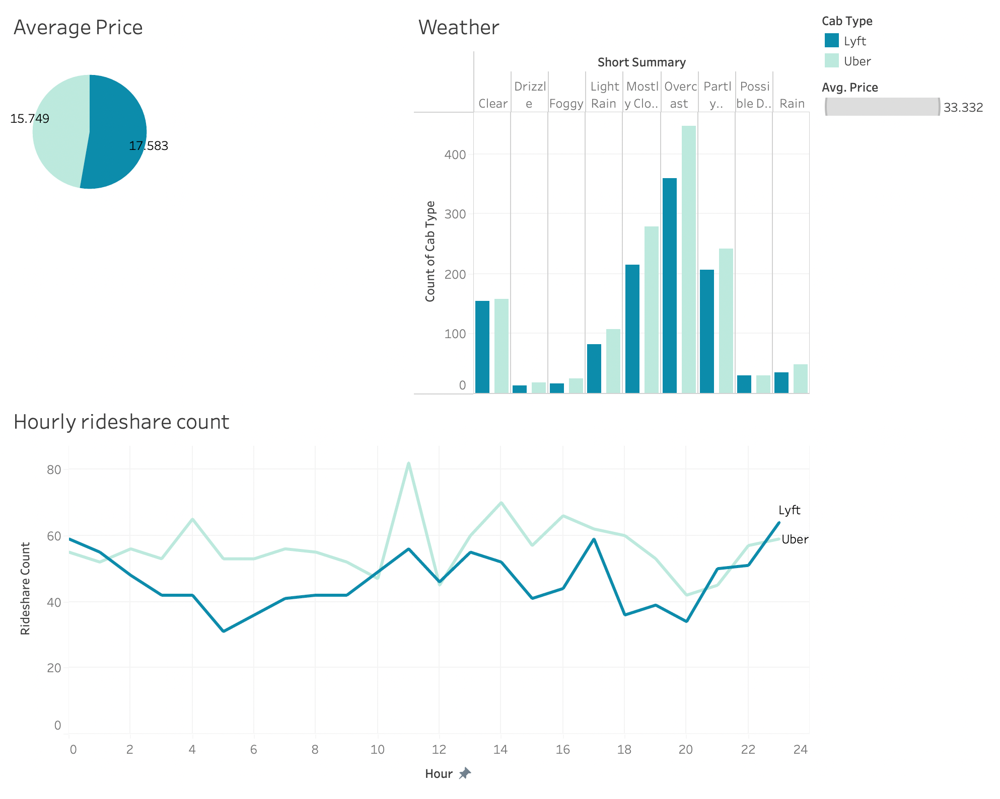

# Lyft vs. Uber
## Table of Contents
- [Abstract](#link-part-1)
- [Design](#link-part-2)
- [Data](#link-part-3)
- [Algorithm](#link-part-4)
- [Tools](#link-part-5)
- [Communication](#link-part-6)

## <a name="link-part-1">Abstract</a>

## <a name="link-part-2">Design</a>

## <a name="link-part-3">Data</a>

## <a name="link-part-4">Algorithm</a>

## <a name="link-part-5">Tools</a>

* **Google Sheets** and **Microsoft Excel** for exploratory data analysis and visualization.
* **Tableau** for visualization.

## <a name="link-part-6">Communication</a>

Project proposal is shown [here](/documents/proposal.md).

MVP document is shown [here](/documents/mvp.md).

The slides are shown [here](/documents/slides.pdf).

The Excel file is shown [here](/rideshare_dataset.xlsx). (Not finished yet)

