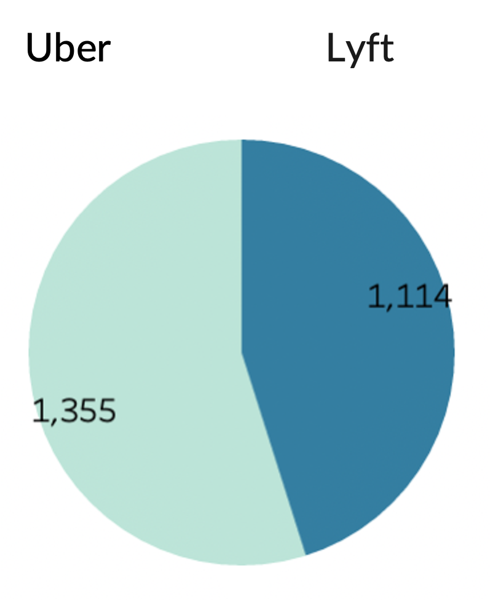

# Lyft vs. Uber
## Table of Contents
- [Abstract](#link-part-1)
- [Design](#link-part-2)
- [Data](#link-part-3)
- [Algorithm](#link-part-4)
- [Tools](#link-part-5)
- [Communication](#link-part-6)

## <a name="link-part-1">Abstract</a>

Lyft is an app similar to Uber but it's not performing as well as Uber. According to the dataset I'm
looking at, 54% of the customers use Uber and 46% of them use Lyft. There isn't a big difference which
is good news, but by analyzing Uber and Lyft ride dataset, we're able to provide Lyft a solution to make its
market share even bigger and gain more profit.

## <a name="link-part-2">Design</a>

Uber and Lyft rideshare data in Boston are accessable for analysis. This dataset shows each ride's
time, destination, price, distance, weather and so on. This can give us lots of information on
people's preference of booking taxies which can help Lyft improve their service.

## <a name="link-part-3">Data</a>

I randomly sampled the Uber and Lyft rideshare dataset in Boston, MA. It contains 2469 rows and
20 columns. It includes the car type, price, distance, datetime, weather, source, coordinates, sunset,
sunrise time, and so on. The data is provided by [Kaggle](https://www.kaggle.com/datasets/brllrb/uber-and-lyft-dataset-boston-ma).

## <a name="link-part-4">Algorithm</a>

- Randomly sample data using Pandas.
- Perform data analysis using Microsoft Excel
- Build vitualizations using Tableau

## <a name="link-part-5">Tools</a>

* **Microsoft Excel** and **Pandas** for data cleaning and exploratory data analysis.
* **Tableau** for visualization.

## <a name="link-part-6">Communication</a>

Lyft has more rides than Uber in Back Bay, Fenway and North station. 

**Conclusions:**
- Sending more drivers to those three areas
- Do survey in Beacon Hill, Haymarket Square, Northeastern University and West End areas to
find out what makes them pick Uber over Lyft

Lyft has less rides than Uber in cloudy and overcast days.

**Conclusion:**
- The reason is likely to be that the UI is not clean enough that it would take much more time
to order on Lyft than Uber based on the graph and my personal experience.

Lyft has more rides than uber after sunset, but have less rides before sunrise.

In certain days every month like the 2nd, the 3rd, the 13th to the 17th and the 27th to the 29th,
more people tend to take Lyft or Uber.

**Conclusion:**
- Building a model to predict daily rideshares will help Lyft decide whether to send more drivers
or to provide some coupons to attract customers.

**Overall Solution:**

- Sending more drivers to Back Bay, Fenway and North station areas.
- Do survey in Beacon Hill, Haymarket Square, Northeastern University and West End areas to
find out what makes them pick Uber over Lyft.
- Enhance user interface to let customers order Lyft more easily and efficiently.
- Building a model to predict daily rideshares to determine whether to send more drivers
or to provide some coupons to attract customers.

Project proposal is shown [here](/documents/proposal.md).

MVP document is shown [here](/documents/mvp.md).

The slides are shown [here](/documents/slides.pdf).

The dataset is shown [here](/data/rideshare_dataset.csv).

