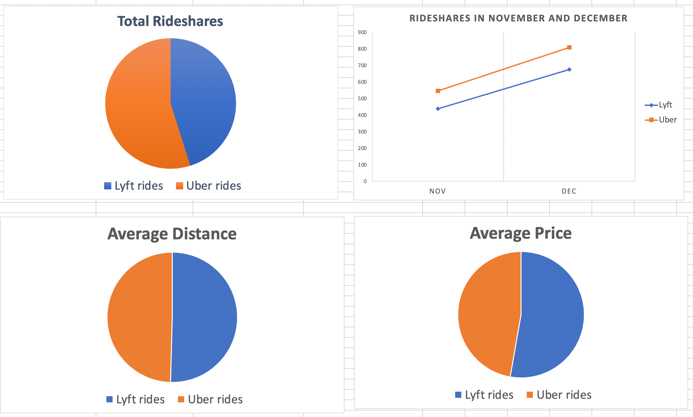

# MVP

## Data Cleaning

The cleaned dataset is shown [here](/data/rideshare_dataset.csv) which
contains 2469 rows and 20 columns.

## Virtualizations

## Conclutions

- Lyft's market share is around 10% less than Uber.
- Lyft's average distance is only slightly higher than Uber but it has a
much higher price. By decreasing the price, Lyft may be able to get more
customers.
