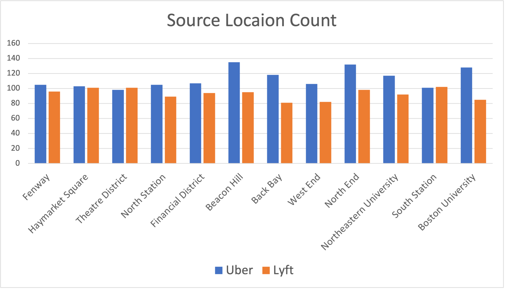

# MVP

## Data Cleaning

The cleaned dataset is shown [here](/data/rideshare_dataset.csv) which
contains 2469 rows and 20 columns.

The Excel file is [here](/rideshare_dataset.xlsx).

## Virtualizations

## Conclutions

- Lyft's market share is around **10%** less than Uber.
- Lyft's average distance per mile is **4%** higher than Uber.
- People in **Theatre District** and **South Station** tend to use Lyft more.
- People don't tend to take Lyft in **Beacon Hill**, **Back Bay** and **Boston University**.

## Solutions
- By decreasing the price, Lyft may be able to get more customers.
- Lyft should increase drivers in **Theatre District** and **South Station** area and try to
see why people don't tend to take Lyft in **Beacon Hill**, **Back Bay** and **Boston University**
area.
